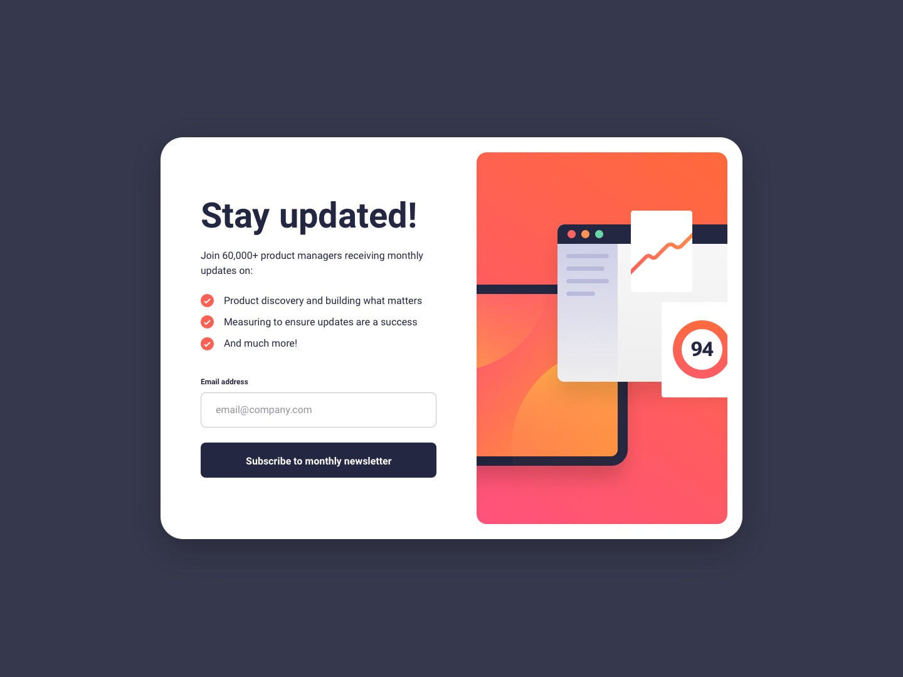
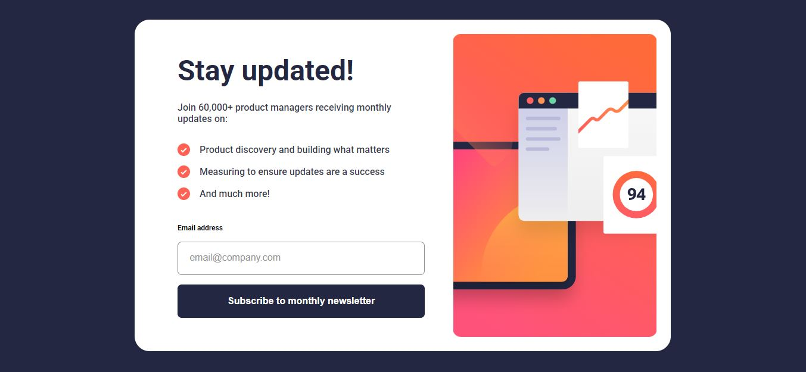

# Frontend Mentor - Newsletter Sign-up Form with Success Message

This is my solution to the Newsletter Sign-Up Form with success message challenge on Frontend Mentor. This project helped me improve my HTML, CSS, and JavaScript skills, especially in form handling and user interaction.



## Table of Contents

* [Overview](#overview)

  * [The Challenge](#the-challenge)
  * [Screenshot](#screenshot)
  * [Links](#links)
* [My Process](#my-process)
  * [Built With](#built-with)
  * [What I Learned](#what-i-learned)
  * [Continued Development](#continued-development)
* [Author](#author)
* [Acknowledgments](#acknowledgments)

---

## Overview

### The Challenge

Users should be able to:

* Add their email and submit the form
* See a success message with their email after successful submission
* See validation messages if:

  * The field is empty
  * The email format is incorrect
* View optimal layout for different screen sizes
* See hover and focus states for interactive elements

---

### Screenshot



---

### Links

* **Solution URL:** https://www.frontendmentor.io/solutions
* **Live Site URL:** https://irfanansari21.github.io/newsletter-sign-up-form/

---

## My Process

### Built With

* Semantic HTML5
* CSS3
* Flexbox
* Mobile-first workflow
* JavaScript (DOM manipulation & form validation)

---

### What I Learned

This project helped me improve my understanding of **form validation and DOM manipulation using JavaScript**. I learned how to handle user input, validate email format, and dynamically update the UI without reloading the page.

One key learning was toggling between the form and success message:

```js
subscribeBtn.addEventListener("click", (e) => {
    e.preventDefault();

    const email = emailInput.value.trim();

    if (!isValidEmail(email)) {
        showError();
        return;
    }

    clearError();
    strongEmail.textContent = email;
    card.style.display = "none";
    successMsg.style.display = "flex";
});
```

---

### Continued Development

In future projects, I want to:

* Improve JavaScript logic and validation techniques
* Learn more about form handling in real-world applications
* Learn React for building scalable UI components

---

## Author

* GitHub – https://github.com/IrfanAnsari21
* Frontend Mentor – https://www.frontendmentor.io/profile/IrfanAnsari21

---

## Acknowledgments

Thanks to Frontend Mentor for providing this challenge. It helped me improve my skills in responsive design and JavaScript form handling.
